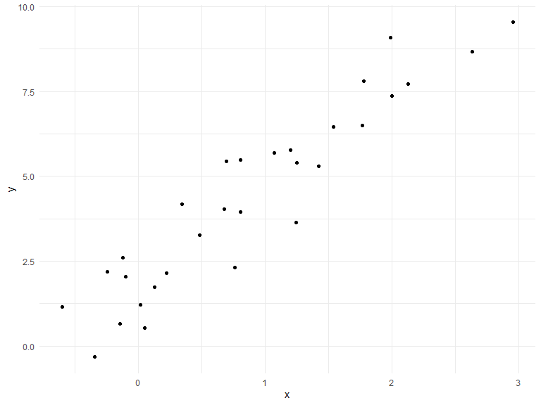

Writing Functions
================
Xun Wang
10/24/2019

## Get started

We’re going to write some functions.

Here’s z scores.

``` r
x = rnorm(n = 30, mean = 4, sd = 2.3)
x_again = rnorm(n = 30, mean = 6, sd = .3)
y = rnorm(n = 30, mean = 24, sd = 2.3)

(x - mean(x)) / sd(x)
```

    ##  [1]  1.19285725 -0.10735856 -0.08279836 -0.64884733  1.21777952
    ##  [6]  1.12778563 -1.07965247 -1.09536301 -0.57922079 -1.11204332
    ## [11] -0.25078009  0.28459688 -1.88181598 -1.88376730 -1.26729361
    ## [16]  1.39050728  0.15697047  0.10692570  1.35756803 -0.01394694
    ## [21] -0.92452959  0.69144163 -0.76103946  1.38690227 -0.07530296
    ## [26]  0.05537537  1.06472658  1.11297094  1.14100519 -0.52365295

``` r
(x_again - mean(x_again)) / sd(x_again)
```

    ##  [1] -0.04106804  0.67930116  1.73742361 -0.39677886  0.47382982
    ##  [6] -0.68741949  0.51051325 -2.12335715  0.58564921 -1.11432446
    ## [11] -0.38038502 -1.11924779  0.16589509  1.30489463 -0.90260002
    ## [16] -0.57499737  1.92706796  1.49068166  0.75664072  0.07308677
    ## [21]  0.69258966  0.06327130 -1.22331577 -0.70124456 -0.48982338
    ## [26]  0.84456240 -0.59954394 -1.68835507  0.92370070 -0.18664700

Now a function.

``` r
z_score = function(x_arg) {
  
  if (!is.numeric(x_arg)) {
    stop("x should be numeric")
  } else if (length(x_arg) < 3) {
    stop("x should be longer than 3")
  }
  
  (x_arg - mean(x_arg)) / sd(x_arg)
  
}
```

Try out the function.

``` r
z_score(x_arg = y)
```

    ##  [1]  1.5016878614 -0.3070101324 -1.9722572220 -1.3422810113 -1.6516519515
    ##  [6]  0.3525460286 -0.1026500382 -0.0129889193  0.5529659982 -0.7107822853
    ## [11]  0.7240088814  0.6006949556 -0.0106187912  2.0321481864  0.9187248276
    ## [16] -1.7033545823  0.9499861694 -0.3349889585 -0.0007036318 -0.0860493308
    ## [21]  0.4665968497  0.3012172279 -0.7309954551  0.5616548583  0.4654536248
    ## [26] -1.7084016144  1.3877738931  0.8038944365 -0.7813771985 -0.1632426764

``` r
z_score(x_arg = 3)
```

    ## Error in z_score(x_arg = 3): x should be longer than 3

``` r
z_score(x_arg = "my name is jeff")
```

    ## Error in z_score(x_arg = "my name is jeff"): x should be numeric

``` r
z_score(x_arg = c(TRUE, TRUE, FALSE, TRUE))
```

    ## Error in z_score(x_arg = c(TRUE, TRUE, FALSE, TRUE)): x should be numeric

``` r
z_score(x_arg = iris)
```

    ## Error in z_score(x_arg = iris): x should be numeric

## Multiple outputs

``` r
mean_and_sd = function(input_x) {
  
  if (!is.numeric(input_x)) {
    stop("x should be numeric")
  } else if (length(input_x) < 3) {
    stop("x should be longer than 3")
  } 
  
  list(
  mean_input = mean(input_x),
  sd_input = sd(input_x),
  z_score = (input_x - mean(input_x)) / sd(input_x)
  )
}
```

test this function

``` r
mean_and_sd(input_x = y)
```

    ## $mean_input
    ## [1] 24.27883
    ## 
    ## $sd_input
    ## [1] 2.314149
    ## 
    ## $z_score
    ##  [1]  1.5016878614 -0.3070101324 -1.9722572220 -1.3422810113 -1.6516519515
    ##  [6]  0.3525460286 -0.1026500382 -0.0129889193  0.5529659982 -0.7107822853
    ## [11]  0.7240088814  0.6006949556 -0.0106187912  2.0321481864  0.9187248276
    ## [16] -1.7033545823  0.9499861694 -0.3349889585 -0.0007036318 -0.0860493308
    ## [21]  0.4665968497  0.3012172279 -0.7309954551  0.5616548583  0.4654536248
    ## [26] -1.7084016144  1.3877738931  0.8038944365 -0.7813771985 -0.1632426764

## Multiple inputs

``` r
sim_data = tibble(
  x = rnorm(30, mean = 1, sd = 1),
  y = 2 + 3 * x + rnorm(30, 0, 1)
)
sim_data %>% 
  ggplot(aes(x = x, y = y)) + 
  geom_point()
```



``` r
ls_fit = lm(y ~ x, data = sim_data)
  
beta0_hat = coef(ls_fit)[1]
beta1_hat = coef(ls_fit)[2]
```

``` r
sim_regression = function(n, beta0 = 2, beta1 = 3) {
  sim_data = tibble(
    x = rnorm(n, mean = 1, sd = 1),
    y = beta0 + beta1 * x + rnorm(n, 0, 1)
  )
  
  ls_fit = lm(y ~ x, data = sim_data)
  
  tibble(
    beta0_hat = coef(ls_fit)[1],
    beta1_hat = coef(ls_fit)[2]
  )
}

sim_regression(n = 3000, beta0 = 17, beta1 = -3)
```

    ## # A tibble: 1 x 2
    ##   beta0_hat beta1_hat
    ##       <dbl>     <dbl>
    ## 1      17.0     -3.00

``` r
sim_regression(3000, 17, -3)
```

    ## # A tibble: 1 x 2
    ##   beta0_hat beta1_hat
    ##       <dbl>     <dbl>
    ## 1      17.0     -2.99

``` r
sim_regression(n = 14, beta0 = 24)
```

    ## # A tibble: 1 x 2
    ##   beta0_hat beta1_hat
    ##       <dbl>     <dbl>
    ## 1      23.0      3.42
