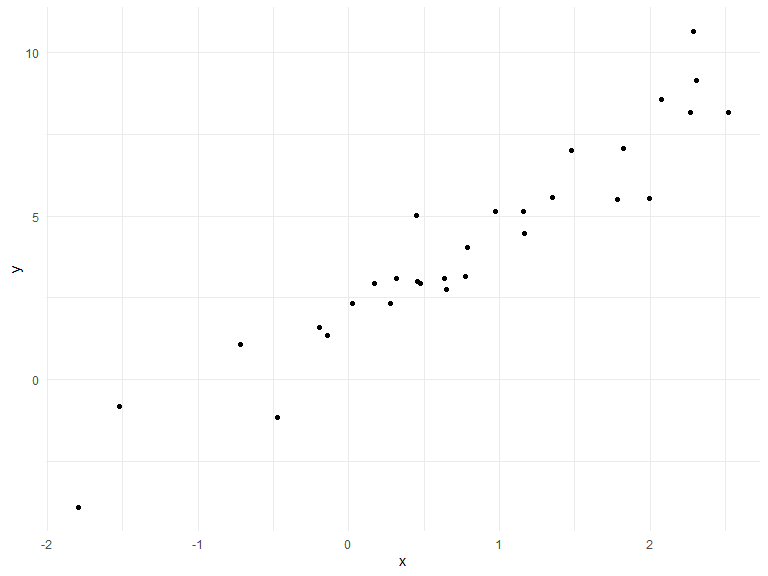

Writing Functions
================
Xun Wang
10/24/2019

## Get started

We’re going to write some functions.

Here’s z scores.

``` r
x = rnorm(n = 30, mean = 4, sd = 2.3)
x_again = rnorm(n = 30, mean = 6, sd = .3)
y = rnorm(n = 30, mean = 24, sd = 2.3)

(x - mean(x)) / sd(x)
```

    ##  [1] -0.53018406  1.82889219 -0.49462173  1.68962891  0.10141997
    ##  [6]  0.90526034  1.23176929 -1.95445038  1.36491721  1.00139943
    ## [11] -0.98863533 -0.28094787 -0.81992891 -0.04359951 -0.31127675
    ## [16]  1.21014964  0.30656271  0.17525660  0.59648866  0.01433448
    ## [21]  0.13748908 -2.05258435  0.01109753  0.03129960 -1.45944004
    ## [26] -0.90505543 -1.39906867 -0.08891454  0.18730104  0.53544092

``` r
(x_again - mean(x_again)) / sd(x_again)
```

    ##  [1] -0.42813931 -0.28305766  1.62471686 -0.60547198  0.79640762
    ##  [6] -0.22541788  0.38853353 -0.07842967 -2.23471296  0.09482128
    ## [11] -0.33141255 -1.64290375  1.39958055  0.31892952 -1.83458816
    ## [16]  1.88381922 -0.67685929  1.11013887 -0.71324018 -1.18028214
    ## [21]  0.95629701 -0.14132222  0.68669884  0.39967280  0.61094123
    ## [26]  1.11942068 -0.25017526  0.34269363 -1.06535308 -0.04130557

Now a function.

``` r
z_score = function(x_arg) {
  
  if (!is.numeric(x_arg)) {
    stop("x should be numeric")
  } else if (length(x_arg) < 3) {
    stop("x should be longer than 3")
  }
  
  (x_arg - mean(x_arg)) / sd(x_arg)
  
}
```

Try out the function.

``` r
z_score(x_arg = y)
```

    ##  [1]  0.35347060 -0.52995777  0.87606369  2.67923955  0.32612882
    ##  [6] -0.20160236 -0.15897095  1.17046193  0.06848394  0.22892412
    ## [11] -0.90045391 -1.14765077  0.39618094 -0.40856975  2.03978863
    ## [16] -0.36512110  0.74391999  1.53459644 -0.26437196 -0.65397681
    ## [21] -1.37929443 -0.59471098 -1.08174602 -0.08718551 -0.54668796
    ## [26] -0.83247317 -0.80586497  0.43266982 -1.71796338  0.82667334

``` r
z_score(x_arg = 3)
```

    ## Error in z_score(x_arg = 3): x should be longer than 3

``` r
z_score(x_arg = "my name is jeff")
```

    ## Error in z_score(x_arg = "my name is jeff"): x should be numeric

``` r
z_score(x_arg = c(TRUE, TRUE, FALSE, TRUE))
```

    ## Error in z_score(x_arg = c(TRUE, TRUE, FALSE, TRUE)): x should be numeric

``` r
z_score(x_arg = iris)
```

    ## Error in z_score(x_arg = iris): x should be numeric

## Multiple outputs

``` r
mean_and_sd = function(input_x) {
  
  if (!is.numeric(input_x)) {
    stop("x should be numeric")
  } else if (length(input_x) < 3) {
    stop("x should be longer than 3")
  } 
  
  list(
  mean_input = mean(input_x),
  sd_input = sd(input_x),
  z_score = (input_x - mean(input_x)) / sd(input_x)
  )
}
```

test this function

``` r
mean_and_sd(input_x = y)
```

    ## $mean_input
    ## [1] 23.98122
    ## 
    ## $sd_input
    ## [1] 2.639242
    ## 
    ## $z_score
    ##  [1]  0.35347060 -0.52995777  0.87606369  2.67923955  0.32612882
    ##  [6] -0.20160236 -0.15897095  1.17046193  0.06848394  0.22892412
    ## [11] -0.90045391 -1.14765077  0.39618094 -0.40856975  2.03978863
    ## [16] -0.36512110  0.74391999  1.53459644 -0.26437196 -0.65397681
    ## [21] -1.37929443 -0.59471098 -1.08174602 -0.08718551 -0.54668796
    ## [26] -0.83247317 -0.80586497  0.43266982 -1.71796338  0.82667334

## Multiple inputs

``` r
sim_data = tibble(
  x = rnorm(30, mean = 1, sd = 1),
  y = 2 + 3 * x + rnorm(30, 0, 1)
)
sim_data %>% 
  ggplot(aes(x = x, y = y)) + 
  geom_point()
```



``` r
ls_fit = lm(y ~ x, data = sim_data)
  
beta0_hat = coef(ls_fit)[1]
beta1_hat = coef(ls_fit)[2]
```

``` r
sim_regression = function(n, beta0 = 2, beta1 = 3) {
  sim_data = tibble(
    x = rnorm(n, mean = 1, sd = 1),
    y = beta0 + beta1 * x + rnorm(n, 0, 1)
  )
  
  ls_fit = lm(y ~ x, data = sim_data)
  
  tibble(
    beta0_hat = coef(ls_fit)[1],
    beta1_hat = coef(ls_fit)[2]
  )
}

sim_regression(n = 3000, beta0 = 17, beta1 = -3)
```

    ## # A tibble: 1 x 2
    ##   beta0_hat beta1_hat
    ##       <dbl>     <dbl>
    ## 1      17.0     -2.96

``` r
sim_regression(3000, 17, -3)
```

    ## # A tibble: 1 x 2
    ##   beta0_hat beta1_hat
    ##       <dbl>     <dbl>
    ## 1      17.0     -2.98

``` r
sim_regression(n = 14, beta0 = 24)
```

    ## # A tibble: 1 x 2
    ##   beta0_hat beta1_hat
    ##       <dbl>     <dbl>
    ## 1      24.7      2.44

## Scrape lots of napoleon

``` r
url = "https://www.amazon.com/product-reviews/B00005JNBQ/ref=cm_cr_arp_d_viewopt_rvwer?ie=UTF8&reviewerType=avp_only_reviews&sortBy=recent&pageNumber=1"

dynamite_html = read_html(url)

review_titles = 
  dynamite_html %>%
  html_nodes("#cm_cr-review_list .review-title") %>%
  html_text()

review_stars = 
  dynamite_html %>%
  html_nodes("#cm_cr-review_list .review-rating") %>%
  html_text()

review_text = 
  dynamite_html %>%
  html_nodes(".review-text-content span") %>%
  html_text()

reviews = tibble(
  title = review_titles,
  stars = review_stars,
  text = review_text
)
```

Now as a function

``` r
read_page_reviews = function(page_url) {
  
  dynamite_html = read_html(page_url)
  
  review_titles = 
    dynamite_html %>%
    html_nodes("#cm_cr-review_list .review-title") %>%
    html_text()
  review_stars = 
    dynamite_html %>%
    html_nodes("#cm_cr-review_list .review-rating") %>%
    html_text()
  
  review_text = 
    dynamite_html %>%
    html_nodes(".review-text-content span") %>%
    html_text()
  
  reviews = tibble(
    title = review_titles,
    stars = review_stars,
    text = review_text
  )
  
  reviews
  
}
```

Now i can read a lot of page reviews\! Although I’m back to
copy-and-pasting code …

``` r
read_page_reviews("https://www.amazon.com/product-reviews/B00005JNBQ/ref=cm_cr_arp_d_viewopt_rvwer?ie=UTF8&reviewerType=avp_only_reviews&sortBy=recent&pageNumber=1")
```

    ## # A tibble: 0 x 3
    ## # ... with 3 variables: title <chr>, stars <chr>, text <chr>

``` r
read_page_reviews("https://www.amazon.com/product-reviews/B00005JNBQ/ref=cm_cr_arp_d_viewopt_rvwer?ie=UTF8&reviewerType=avp_only_reviews&sortBy=recent&pageNumber=2")
```

    ## # A tibble: 0 x 3
    ## # ... with 3 variables: title <chr>, stars <chr>, text <chr>

``` r
read_page_reviews("https://www.amazon.com/product-reviews/B00005JNBQ/ref=cm_cr_arp_d_viewopt_rvwer?ie=UTF8&reviewerType=avp_only_reviews&sortBy=recent&pageNumber=3")
```

    ## # A tibble: 0 x 3
    ## # ... with 3 variables: title <chr>, stars <chr>, text <chr>

``` r
read_page_reviews("https://www.amazon.com/product-reviews/B00005JNBQ/ref=cm_cr_arp_d_viewopt_rvwer?ie=UTF8&reviewerType=avp_only_reviews&sortBy=recent&pageNumber=4")
```

    ## # A tibble: 0 x 3
    ## # ... with 3 variables: title <chr>, stars <chr>, text <chr>

## Scoping

Mean example …

``` r
f = function(x) {
  z = x + y
  z
}

x = 1
y = 2

f(x = 2)
```

    ## [1] 4
